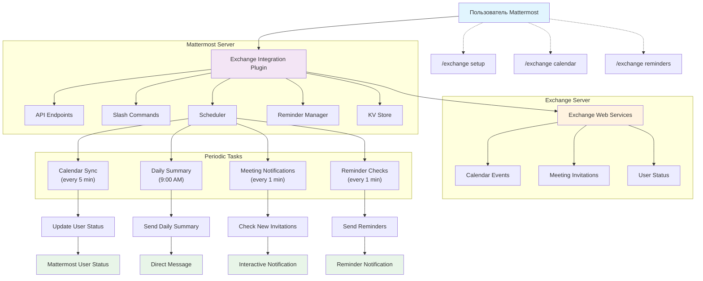
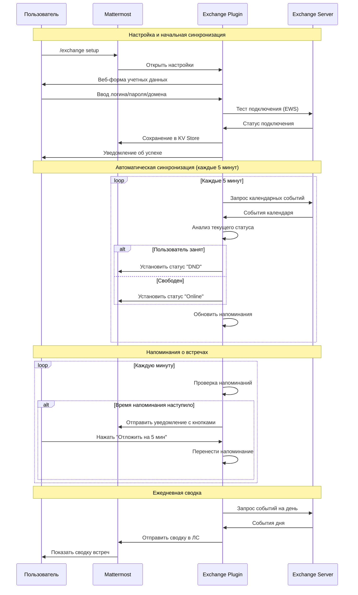

# BIT.Digit: Mattermost Exchange Integration Plugin

БИТ.Цифра: Плагин для интеграции Mattermost с Microsoft Exchange Server, обеспечивающий автоматическую синхронизацию календаря и статуса пользователей.

## Возможности

### 🔄 Автоматическая синхронизация статуса
- Обновление статуса пользователя в Mattermost на основе календарных событий Exchange
- Автоматическое определение занятости (Busy, Free, Tentative, Out of Office)
- Синхронизация каждые 5 минут

### 📅 Система напоминаний
- Автоматические напоминания о предстоящих встречах
- Настраиваемое время напоминания (по умолчанию 15 минут)
- Интерактивные уведомления с кнопками действий
- Возможность отложить напоминание на 5 минут

### 📧 Уведомления о встречах
- Уведомления о новых приглашениях на встречи
- Кнопки быстрого ответа (Принять/Отклонить/Возможно)
- Ежедневная утренняя сводка встреч в 9:00

### ⚡ Slash-команды
- `/exchange setup` - настройка учетных данных Exchange
- `/exchange status` - проверка статуса подключения
- `/exchange calendar` - просмотр календаря на сегодня
- `/exchange reminders` - управление напоминаниями
- `/exchange help` - справка по командам

### 🌐 Web-интерфейс
- Удобная настройка учетных данных через веб-форму
- Тестирование подключения к Exchange
- Управление настройками напоминаний

## 🏗️ Архитектура и процесс работы



### Описание компонентов:

**🔧 Основные модули:**
- **API Endpoints** - REST API для веб-интерфейса и внешних интеграций
- **Slash Commands** - команды `/exchange` для управления через чат
- **Scheduler** - планировщик периодических задач
- **Reminder Manager** - система управления напоминаниями
- **KV Store** - безопасное хранение учетных данных пользователей

**⏰ Периодические задачи:**
- **Calendar Sync** (каждые 5 минут) - синхронизация календаря и обновление статуса
- **Daily Summary** (9:00 утра) - отправка ежедневной сводки встреч
- **Meeting Notifications** (каждую минуту) - проверка новых приглашений
- **Reminder Checks** (каждую минуту) - отправка напоминаний о встречах

**📡 Интеграция с Exchange:**
- Подключение через Exchange Web Services (EWS)
- Получение календарных событий и приглашений
- Обновление статуса пользователя на основе занятости

### Поток взаимодействий:



## Технические характеристики

### Архитектура
- **Серверная часть**: Go 1.24.3
- **Клиентская часть**: TypeScript/React
- **Протокол**: Exchange Web Services (EWS)
- **База данных**: Mattermost KV Store

### Системные требования
- Mattermost Server v9.0+ (рекомендуется v9.11+)
- Microsoft Exchange Server 2013+
- Доступ к Exchange Web Services (EWS)

> **Важно:** Для Mattermost 6.x-8.x используйте v1.1.0. Для Mattermost 9.x+ используйте v1.2.1.

## Установка

1. Скачайте последнюю версию плагина: [`releases/com.mattermost.exchange-plugin-1.2.1.tar.gz`](releases/com.mattermost.exchange-plugin-1.2.1.tar.gz)
2. Перейдите в System Console → Plugins → Plugin Management
3. Нажмите "Choose File" и выберите файл плагина
4. Нажмите "Upload" и затем "Enable"

## Настройка

### Настройка плагина (Администратор)
1. System Console → Plugins → Exchange Integration
2. Укажите URL Exchange сервера
3. Настройте параметры синхронизации и уведомлений

### Настройка пользователя
1. Используйте команду `/exchange setup`
2. Или нажмите на иконку 📧 в заголовке канала
3. Или найдите "Exchange Settings" в главном меню
4. Введите учетные данные Exchange:
   - Домен
   - Имя пользователя
   - Пароль

### 🐛 Диагностика проблем с модальным окном

Если после нажатия на "Exchange Settings" модальное окно не открывается:

#### Шаг 1: Проверьте консоль браузера
1. Откройте консоль разработчика (F12)
2. Нажмите "Exchange Settings"
3. Проверьте логи в консоли:
   ```
   Exchange Plugin: Opening modal from main menu
   Exchange Plugin: Current Redux state: {...}
   Exchange Plugin: Modal isOpen: true/false
   ```

#### Шаг 2: Принудительное открытие модального окна
Выполните в консоли браузера:
```javascript
// Принудительно открыть модальное окно
window.exchangePluginDebug.openModal();

// Проверить состояние Redux
console.log(window.exchangePluginDebug.getState());

// Альтернативный способ
window.exchangePluginForceShowModal = true;
window.exchangePluginDebug.dispatch({type: 'EXCHANGE_PLUGIN_DEBUG'});
```

#### Шаг 3: Перезагрузка плагина
1. System Console → Plugins → Plugin Management
2. Найдите "Exchange Integration"
3. Нажмите "Disable" → "Enable"
4. Обновите страницу браузера (Ctrl+F5)

## API Endpoints

- `POST /api/v1/credentials` - Сохранение учетных данных
- `GET /api/v1/calendar` - Получение календарных событий
- `POST /api/v1/meeting/{action}` - Ответ на приглашение (accept/decline/tentative)
- `GET /api/v1/reminders` - Получение напоминаний
- `POST /api/v1/reminders/update` - Обновление напоминаний
- `POST /api/v1/reminder/snooze` - Отложить напоминание
- `POST /api/v1/calendar/open` - Открыть календарь

## Разработка

### Сборка проекта
```bash
# Сборка плагина
make dist

# Только серверная часть
make server

# Только веб-интерфейс
make webapp

# Тестирование
make test
```

### Структура проекта
```
├── server/              # Серверная часть (Go)
│   ├── api.go          # HTTP API обработчики
│   ├── plugin.go       # Основная логика плагина
│   ├── exchange.go     # Интеграция с Exchange
│   ├── reminder.go     # Система напоминаний
│   ├── scheduler.go    # Планировщик задач
│   ├── commands.go     # Slash-команды
│   └── configuration.go # Конфигурация
├── webapp/             # Веб-интерфейс (React)
│   └── src/
├── plugin.json         # Манифест плагина
└── Makefile           # Скрипты сборки
```

## Качество кода

- ✅ Go vet: чистый код без ошибок
- ✅ Staticcheck: минимальные предупреждения
- ✅ Deadcode analysis: нет неиспользуемого кода
- ✅ Цикломатическая сложность: в пределах нормы
- ✅ Размер сборки: 21MB

## Безопасность

- Безопасное хранение учетных данных в Mattermost KV Store
- Шифрованная передача данных по HTTPS
- Поддержка самоподписанных сертификатов Exchange
- Базовая HTTP аутентификация с доменными учетными записями

## Лицензия

MIT License

## Поддержка

Для сообщений о проблемах и предложений используйте [GitHub Issues](https://github.com/chastnik/mattermost_plugin_exchange_firstbit/issues).

## 📦 Скачать готовый плагин

Готовые к установке версии плагина доступны в папке `releases/`:

- **[v1.2.1](releases/com.mattermost.exchange-plugin-1.2.1.tar.gz)** (21MB) - **РЕКОМЕНДУЕМАЯ** (для Mattermost 9.x+)
- **[v1.2.0](releases/com.mattermost.exchange-plugin-1.2.0.tar.gz)** (21MB) - Совместимость с Mattermost 9.x
- **[v1.1.0](releases/com.mattermost.exchange-plugin-1.1.0.tar.gz)** (21MB) - Исправления веб-интерфейса (для Mattermost 6.x-8.x)
- **[v1.0.0](releases/com.mattermost.exchange-plugin-1.0.0.tar.gz)** (21MB) - Первоначальная версия

### Как установить:
1. Скачайте файл `.tar.gz` из папки `releases/`
2. В Mattermost перейдите: System Console → Plugins → Plugin Management
3. Нажмите "Choose File" и выберите скачанный файл
4. Нажмите "Upload" → "Enable"

## Changelog

### v1.2.1 (2025-07-04)
- 🐛 **КРИТИЧЕСКОЕ ИСПРАВЛЕНИЕ:** Исправлена проблема с модальным окном в Mattermost 9.x
- ✅ Модальное окно настроек теперь корректно открывается
- 🔧 Улучшена совместимость Redux состояния с Mattermost 9.11.16
- ⚡ Добавлены множественные пути для поиска состояния плагина
- 🎯 Принудительное отображение модального окна для диагностики
- 🚀 Глобальные debug функции: `window.exchangePluginDebug`
- 📊 Расширенное логирование Redux actions и состояния
- 🔧 Множественная регистрация reducer для максимальной совместимости

### v1.2.0 (2025-07-04)
- 🔄 **Обновлена совместимость с Mattermost 9.x**
- ✅ Изменен min_server_version на 9.0.0
- 🔧 Исправлен webpack output для Mattermost 9.x
- ⚡ Добавлены fallback методы регистрации
- 🌐 Глобальная доступность плагина в window.plugins namespace

### v1.1.0 (2025-07-04)
- 🐛 **КРИТИЧЕСКОЕ ИСПРАВЛЕНИЕ:** Исправлена проблема с веб-интерфейсом
- ✅ Кнопки настройки теперь появляются в Mattermost UI
- 🔧 Пересобрана веб-часть плагина с правильной конфигурацией
- ⚡ Добавлена правильная конфигурация TypeScript и webpack
- 🎯 Создан отсутствующий Redux reducer для управления состоянием
- 🚀 Исправлены React компоненты для корректной работы
- 📦 Обновлен размер webpack bundle (14.5KB вместо 33 байт)

### v1.0.0 (2025-07-03)
- ✨ Начальный релиз
- 🔄 Автоматическая синхронизация статуса с календарем
- ⏰ Система напоминаний о встречах
- 📧 Уведомления о новых приглашениях
- 💬 Поддержка slash-команд
- 🌐 Веб-интерфейс для настройки
- 📱 Интерактивные уведомления с кнопками действий 